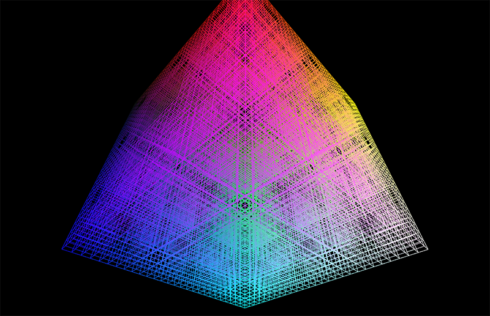

# TCT-CC-002-Menger-Sponge-Fractal

A 3D sketch (created in Processing) of the Menger Sponge Fractal. Based on The Coding Train's [coding challenge #002](https://youtu.be/LG8ZK-rRkXo?si=BAn32rdbzOnEs7qQ)

[Menger Sponge on Wikipedia](https://en.wikipedia.org/wiki/Menger_sponge)

Here's [a nice 4k video.](https://vimeo.com/upheremedia/processing-menger-sponge-fractal?share=copy)

